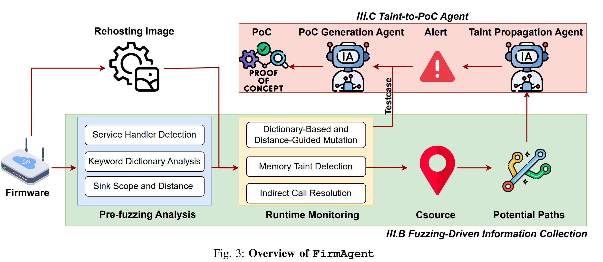

# FirmAgent

**⚠️ Legal/Ethical Notice**
Only test targets you own or have explicit written permission to assess. You are solely responsible for compliance with local laws, licenses, and organizational policies.

------

## Table of Contents

- [Overview](#overview)

- [Prerequisites](#prerequisites)

- [Quick Start](#quick-start)

- [Workflow](#workflow)

  - [1) Pre-fuzzing Analysis](#1-pre-fuzzing-analysis)
  - [2) Runtime Monitoring](#2-runtime-monitoring)
  - [3) Fuzzing](#3-fuzzing)
  - [4) Taint-to-PoC Agent](#4-taint-to-poc-agent)

- [Input/Output Schemas](#inputoutput-schemas)

  - [Pre_fuzzing.json](#pre_fuzzingjson-api-definitions)
  - [Fuzzing output files](#fuzzing-output-files)

- [Configuration Reference](#configuration-reference)

- [Tips & Best Practices](#tips--best-practices)

- [Troubleshooting](#troubleshooting)

- [FAQ](#faq)

  

------

## Overview

This toolkit automates an end-to-end workflow for discovering and validating vulnerabilities in re-hosted IoT firmware:

1. **Fuzzing-Driven Information Collection**

   - Extract all target URIs and input parameters.
   - Locate sink functions and compute distances from basic blocks to sinks.
   - Produce mutation dictionaries for the fuzzer.

   - Instrumented QEMU binaries collect control-flow data during fuzzing.
   - Optional: Build emulation images directly with a helper script.

   - Generic, device-aware API fuzzer with configurable `Host` header.
   - Uses the pre-fuzzing artifacts to generate requests and mutations.

2. **Taint-to-PoC Agent**

   - LLM-assisted taint analysis to findings vulnerabilities and produce PoCs.


------

## Prerequisites

- **Python**: 3.8+
   Install Python dependencies:

  ```
  pip install -r requirements.txt
  ```

- **Emulation**: Greenhouse (Details can be found in https://github.com/sefcom/greenhouse.git)

  - We ship instrumented binaries under `FirmAgent/FuzzingRecord/gh3fuzz/fuzz_bins/qemu/`.
  - Control-flow collector: `libibresolver.so`.

- **Target firmware**: Obtain and re-host the firmware image 

- **Setting Environment Variables:**

  export IDAT_BIN=/path/to/idat64

  export Private_API_KEY={API_KEY}

------


## Quick Start

1. **Run pre-fuzzing** (single command):

  Simply run the automated pipeline script:

  ```
  ./Pre_Fuzzing/run.sh <target_binary>
  ```

  This single command will:
  - Export decompiled code and strings from IDA Pro
  - Extract API endpoints and parameters using LLM
  - Identify sink function address ranges
  - Compute distances from basic blocks to sinks

  **Outputs** (in the same directory as `<target_binary>`):
  - `Pre_fuzzing.json` - Complete fuzzing input schema with APIs and parameters
  - `sink_scope_addr.txt` - Sink function address ranges
  - `sink_distance_scores.json` / `sink_distance_scores.csv` - Distance scores for prioritization
  - `export-for-ai-<binary_name>/` - Decompiled evidence directory

2. **Build an emulated image (optional, automated wiring)**:

```
python build_fuzz_img.py
```

This integrates the instrumentation and supporting binaries into the emulation image.

2. **Start fuzzing** (from the host):

  **⚠️ Important:** Before running the fuzzer, you need to customize the request templates in `FuzzingRecord/Fuzzer.py` to match your target device's API format (e.g., request headers, authentication, payload structure).

  ```
  python FuzzingRecord/Fuzzer.py \
    --json-file Pre_fuzzing.json \
    --delay 0.5 \
    --host {target_ip_or_domain}
  ```

  **Fuzzing outputs:**
  - `result.json` - Request packets and responses produced by `FuzzingRecord/Fuzzer.py`
  - `fuzzing_results.log` - Detailed fuzzing logs
  - `Source.json` / `source.json` - Runtime-monitoring artifact containing source addresses and reachable test cases; this file is consumed by `LLMATaint.py` but is not generated by the current `FuzzingRecord/Fuzzer.py` alone

3. **Run LLM-assisted taint analysis to generate PoCs**:

  Place the runtime-monitoring artifact (`Source.json` or `source.json`) in the **same folder as the target binary**, then run:

  ```
  python LLMATaint.py \
    -b {path_to_binary} \
    -p {True|False} \
    -t {vuln_type} \
    -o {path_to_resultfolder} \
    -m {model}
  ```

  Supported model values currently used by the code include: `R1_official`, `V3_official` for the current `LLMAPIThree` path used by `LLMATaint.py`

  The taint analysis agent will:
  - Analyze the taint flow from source points identified during fuzzing
  - Use the reachable test cases as base request packets during later validation / PoC generation
  - First determine whether an alert exists, then validate it and generate concrete PoCs

------

## Workflow

### 1) Pre-fuzzing Analysis

**Goal:** Collect everything needed to drive effective mutations and triage.

The pre-fuzzing pipeline (`Pre_Fuzzing/run.sh`) automates the following steps:

1. **Decompilation export** (`Pre_Fuzzing/decompile.py`)
   - Exports decompiled functions, strings, memory dumps, imports/exports
   - Creates `export-for-ai-<binary_name>/` directory with all evidence

2. **API & parameter extraction** (`Pre_Fuzzing/llm_extract_api_params.py`)
   - Uses LLM to analyze decompiled code and extract:
     - API endpoints (goform handlers, URL routes, etc.)
     - Parameter names and types from function callsites
   - Generates `Pre_fuzzing.json` with complete fuzzing schema

3. **Sink scope extraction** (`Pre_Fuzzing/Get_SinkFunc.py`)
   - Identifies dangerous sink functions (system calls, strcpy, etc.)
   - Traces backward from sinks to find all reachable functions
   - Outputs `sink_scope_addr.txt` with address ranges

4. **Distance calculation** (`Pre_Fuzzing/Distance.py`)
   - Computes shortest path distances from basic blocks to sinks
   - Prioritizes fuzzing targets closer to dangerous sinks
   - Outputs `sink_distance_scores.json` / `sink_distance_scores.csv`

**Outputs:**

- `Pre_fuzzing.json` - Complete fuzzing input schema (APIs + parameters)
- `sink_scope_addr.txt` - Sink function address ranges
- `sink_distance_scores.json` / `sink_distance_scores.csv` - Distance scores for prioritization

### 2) Runtime Monitoring

We provide an instrumented QEMU stack and a control-flow recording library:

- **Location:**
   `FirmAgent/FuzzingRecord/gh3fuzz/fuzz_bins/qemu/`
  - `libibresolver.so` collects control-flow events.
- **Recommended path:**
  - Use `build_fuzz_img.py` to assemble the emulation image.
  - Instrumentation and collectors are automatically integrated.
- **Customization:**
   You can extend `qemuafl` to log additional runtime signals.
   We provide our **Fuzzing-SA** source for reference (see repo).

### 3) Fuzzing

**⚠️ Before running:** Customize `FuzzingRecord/Fuzzer.py` to match your target device's API format:
- Update request headers (authentication tokens, cookies, etc.)
- Adjust payload structure if your device uses non-standard formats
- Configure device-specific error detection patterns

Run the generic fuzzer against your re-hosted device:

```
python FuzzingRecord/Fuzzer.py \
  --json-file Pre_fuzzing.json \
  --delay 0.5 \
  --host {target_ip_or_domain}
```

- `--json-file` — Pre-fuzzing output containing API definitions.
- `--delay` — Inter-request sleep to avoid rate-limits / WAFs.
- `--host` — Value for the `Host` header (supports SNI / vhosts).

**What happens:**

- The fuzzer parses `Pre_fuzzing.json` and parameter templates.
- For each endpoint & parameter, it generates mutations (e.g., command-injection, XSS, traversal).
- Requests and responses are logged to `fuzzing_results.log`.
- Structured request/response packets are written to `result.json` next to the input JSON.
- Potential vulnerabilities are flagged based on error codes, timing, and content indicators.
- Source-address artifacts used by `LLMATaint.py` must be supplied separately by the runtime monitoring / instrumentation component as `Source.json` or `source.json`.

**Fuzzing outputs:**

- `result.json` - Structured request packets and responses written by `FuzzingRecord/Fuzzer.py`
- `Source.json` / `source.json` - Source addresses and their corresponding reachable test cases (required for taint analysis; produced by runtime monitoring rather than by the current fuzzer script alone)
- `fuzzing_results.log` - Human-readable progress and warnings

### 4) Taint-to-PoC Agent

Once fuzzing identifies source points and generates test cases, use LLM-assisted taint analysis to validate and transform findings into concrete PoCs:

```
python LLMATaint.py \
  -b {path_to_binary} \
  -p {True|False} \
  -t {vuln_type} \
  -o {path_to_resultfolder} \
  -m {model}
```

Supported model values currently used by the code include `R1_official` and `V3_official` for the default `LLM_analysis()` path.

**Prerequisites:**
- Place `Source.json` or `source.json` (contains source addresses and reachable test cases) in the **same directory** as the target binary
- If available, place `Indirect_call.json` or `indirect_data.json` (caller-callee pairs) in the same directory

**What the agent does:**

- Analyzes taint flow from source points identified during fuzzing
- Uses reachable test cases from `Source.json` / `source.json` as base packets during later PoC generation
- Traces data flow through decompiled code to identify vulnerable paths
- Uses a two-stage process: first taint/alert judgment, then validation + PoC generation
- Produces validated exploit code with proper input formatting

------

## Input/Output Schemas

### Pre_fuzzing.json (API definitions)

Preferred format used by the current `FuzzingRecord/Fuzzer.py`:

```
{
  "api_endpoints": [
    "/nitro/v1/config/example_endpoint",
    "/apply.cgi"
  ],
  "para": [
    "username",
    "cmd",
    "action"
  ]
}
```

Legacy array-of-objects input is still partially supported for endpoint extraction, but the current fuzzer primarily expects:

- `api_endpoints`: Relative API paths.
- `para`: Parameter names used to build per-parameter taint payloads.

### Fuzzing output files

- **`fuzzing_results.log`** — Human-readable progress and warnings.
- **`result.json`** — Structured request packets and responses emitted by `FuzzingRecord/Fuzzer.py`.
- **`Source.json` / `source.json`** — Source addresses and their corresponding reachable test cases (required for taint analysis; produced by runtime monitoring / instrumentation).
- **`Indirect_call.json`** / **`indirect_data.json`** (optional) — Caller-callee pairs for indirect call resolution.

------


### Example Commands Recap

**Run pre-fuzzing (single command):**

```
./Pre_Fuzzing/run.sh /path/to/httpd
```

This generates `Pre_fuzzing.json`, `sink_scope_addr.txt`, and distance scores in the same directory as the binary.

**Run fuzzing (host):**

⚠️ Remember to customize `FuzzingRecord/Fuzzer.py` request templates first!

```
python FuzzingRecord/Fuzzer.py \
  --json-file Pre_fuzzing.json \
  --delay 0.5 \
  --host 192.168.0.1
```

This generates `result.json` (request packets and responses). A separate runtime-monitoring step should generate `Source.json` / `source.json` for taint analysis.

**Run taint-to-PoC agent:**

Place `Source.json` or `source.json` in the same directory as the binary, then:

```
python LLMATaint.py \
  -b ./bin/httpd \
  -p False \
  -t ci \
  -o ./results/ASUS \
  -m R1_official
```


**Reference**

If you use or cite this work, please reference:

```bibtex
@inproceedings{Ji2026FirmAgent,
  author    = {Ji, Jiangan and Zhang, Chao and Gan, Shuitao and Lin, Jian and Liu, Hangtian and Liu, Tieming and Zheng, Lei and Jia, Zhipeng},
  title     = {FirmAgent: Leveraging Fuzzing to Assist LLM Agents with IoT Firmware Vulnerability Discovery},
  booktitle = {Network and Distributed System Security (NDSS) Symposium},
  year      = {2026},
  month     = {February},
  pages     = {1--16},
  address   = {San Diego, CA, USA},
  doi       = {10.14722/ndss.2026.231943},
  isbn      = {979-8-9919276-8-0},
  url       = {https://dx.doi.org/10.14722/ndss.2026.231943},
}
```


